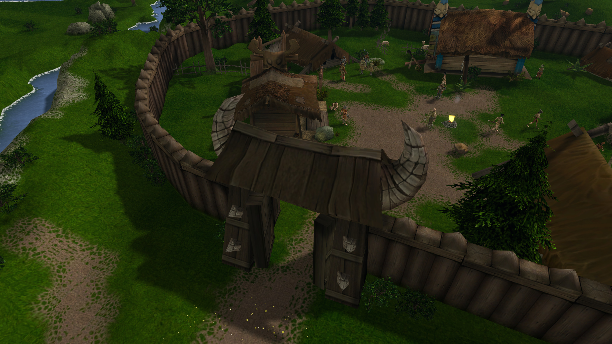
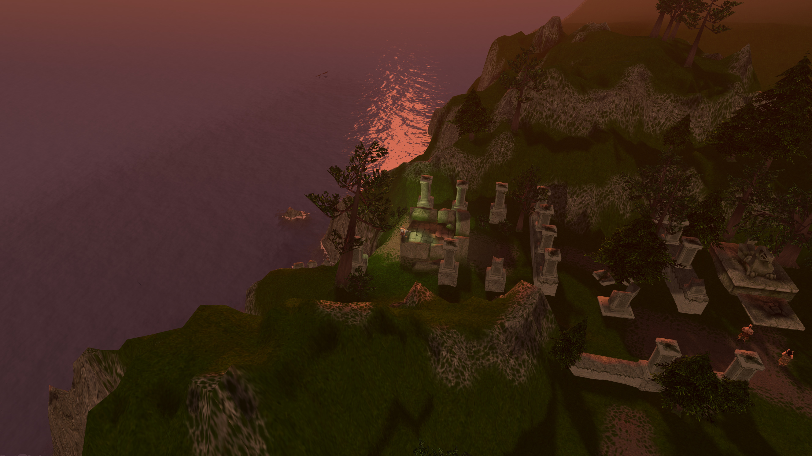
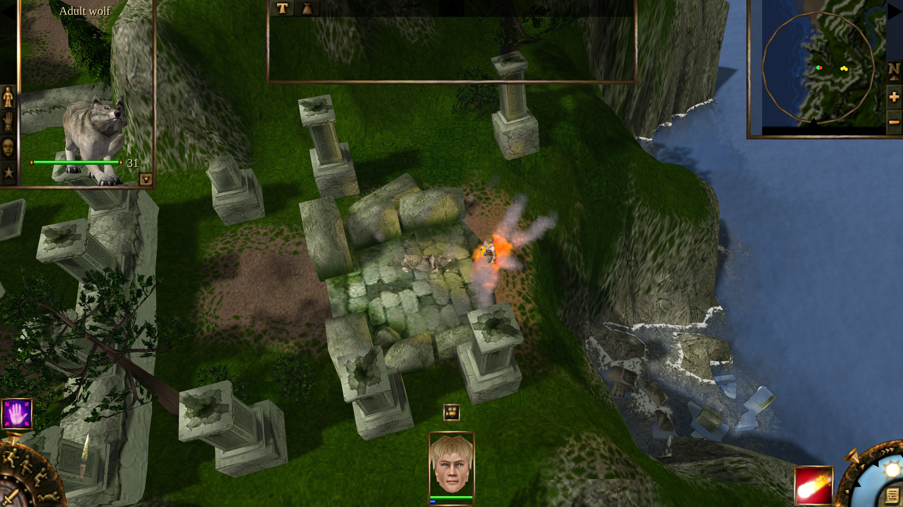
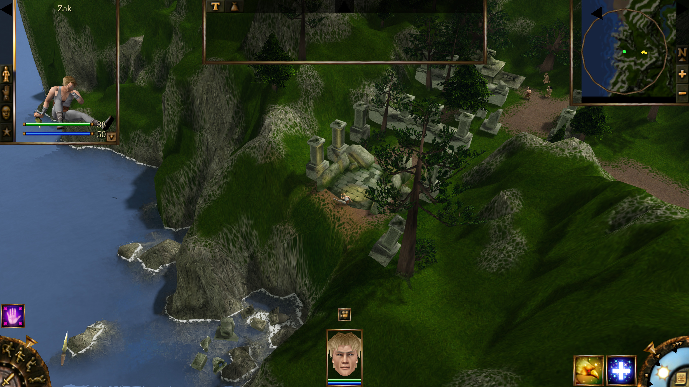
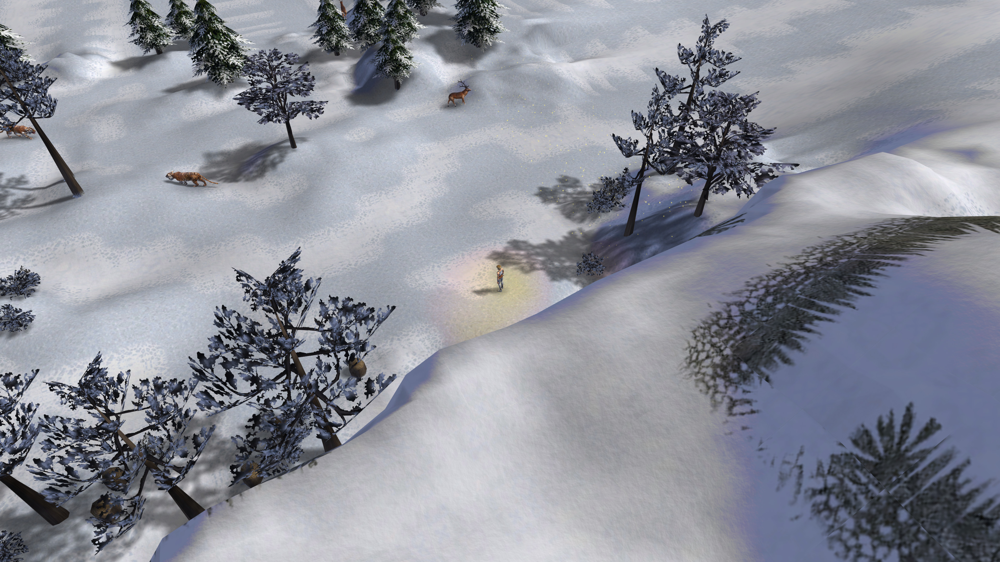

# Cursed Lands

Play **Evil Islands: Curse of the Lost Soul** («Проклятые земли», Nival, 2000) on a modern engine on Windows, Linux and macOS, with the whole campaign playable in **online co-op**.

This is a separate game engine, built in Godot, in the spirit of OpenMW and fheroes2: it reads the Evil Islands files you already own (maps, models, textures, animations, sounds, music, texts, scripts and game tables) and plays them with natively written rendering, combat, AI, scripting and interface systems that follow the original game's rules.

> **You need your own copy of the game.** No game data ships with this engine: no models, textures, music, sounds, videos, texts or maps. Nothing is downloaded for you. The **GOG version** is recommended; it is the one the engine is developed and tested with.

## Screenshots

Captured in the engine at 3840×2160 with content read from the GOG version.

## Download and install

Download the package for your system from the [Releases](https://github.com/TheWWWorm/CursedLands/releases) page.

- **Windows (x86-64):** extract the ZIP and run `CursedLands.exe`. Windows may warn about an unrecognised app; choose **More info → Run anyway**.
- **Linux (x86-64):** extract the archive and run `CursedLands.x86_64`. If your file manager dropped the executable permission, run `chmod +x CursedLands.x86_64` first.
- **macOS (Apple silicon and Intel):** extract the ZIP and open the app. It is not signed or notarized, so macOS may block the first start; allow it under **System Settings → Privacy & Security**.

## Getting started

1. Start the engine.
2. When asked, choose either:
   - the folder of an installed copy of Evil Islands (the one containing `res`, `maps` and `config`), or
   - the GOG offline installer itself (`setup_evil_islands_*.exe`). It is **not run**: the engine unpacks the game files from it once into its own user folder and checks each file. This takes a few minutes, and nothing needs to be installed on Linux or macOS.
3. The chosen folder is remembered. The original intro videos play, then the main menu opens.

**New Game** asks for the difficulty first, as the original does. It can be changed at any time in **Options → Game**.

## Co-op

The whole campaign can be played together. One player chooses **Multiplayer** and creates a game; the others join it by address (add `:port` for a game hosted on another port). The host's machine runs the world, and every player controls their own hero and the mercenaries they hire.

- **Bring your own hero.** A joining player can bring the hero from their own single-player save, with their own gold and bag. Anything they earn, loot or buy is kept when they leave.
- **Shared progress.** Quests the host completes count for a joining player too, if that player has reached the same point in the story. A player who is further ahead simply helps. A player who is behind gets no credit for quests they have not reached yet. When they leave, the progress they made is merged into a new save of their own, so two players can finish the whole campaign together.
- **Router setup.** The host needs incoming connections on **UDP port 27015**. When the router supports it (UPnP), the port is opened automatically and the address to give friends is shown; otherwise forward the port by hand.
- **In game.** Press **Enter** to chat. A player list under the minimap shows each player's ping.
- **Options.** Every party member can get the full experience for a kill, instead of a share (on by default). Monsters can be made stronger with the number of players.
- Players can join a game already in progress. Only the host can save. Single-player pauses while menus are open; co-op never pauses.

## Controls

Keys are read from the game's own `keyboard.ini` and can be changed in **Options → Controls**. The defaults are the original's:

| Input | Action |
|---|---|
| Left click on a hero / drag a frame | select heroes |
| Left click elsewhere | move, attack, talk, loot or use (double click on the ground: run) |
| Spell bar | cast a spell, then click a target (right click cancels) |
| Numpad 8 / 5 / 4 / 6 / 1 / 3 | aimed strike at head / body / arms / legs |
| Z / X / C / V | run / walk / sneak / crawl |
| Tab | quests of the current zone |
| F5 / F8 | quick save / quick load |
| Space | pause |
| Esc | game menu: save, load, options, exit |
| Arrows, screen edges, wheel, middle or right drag | camera (rotate: Delete / End) |

## What is there

- **The full campaign**: all islands, villages, quests, conversations, traders, mercenaries, crafting and scripted scenes, played from the start to the ending, with the original intro and story videos.
- **Original rules**: combat with aimed strikes, wounds and stealth, monster AI and spell choice, pathfinding, traps, levers and gates, day and night, follow the original game's behaviour and tables.
- **Original interface**: the HUD, inventory, trading, spell crafting, journal, dialogues, Load and Save screens and Options use the game's own art and texts and its 800×600 layouts, scaled to your screen.
- **Modern camera**: a free camera that pans, rotates and zooms smoothly and fades walls and roofs out of the way, in the style of modern isometric RPGs. The original fixed camera can be chosen under **Options**.
- **Modern display**: any resolution, windowed or fullscreen, a frame rate limit, a sharper mouse cursor at high resolutions, and optional graphics improvements (better water and terrain detail, sky with sun, moon and stars, swaying vegetation, bloom, ambient occlusion, volumetric fog and heat haze) under **Options → Graphics**.
- **Language**: the game plays in the language of your copy (the English, German and Russian GOG versions are supported).

The engine is still in development. The campaign can be played through, but not every quest variant and co-op situation has been tested. Please report problems on the [Issues](https://github.com/TheWWWorm/CursedLands/issues) page.

## Saves and settings

Saves and settings are kept in the engine's user folder:

- **Windows:** `%APPDATA%\Godot\app_userdata\Cursed Lands`
- **Linux:** `~/.local/share/godot/app_userdata/Cursed Lands`
- **macOS:** `~/Library/Application Support/Godot/app_userdata/Cursed Lands`

## Building from source

Open the `game` folder in [Godot 4.7](https://godotengine.org/) and export with the included presets.

## License

The engine's code is licensed under the Apache License 2.0 (see [LICENSE.md](LICENSE.md)); see [THIRD_PARTY_NOTICES.md](THIRD_PARTY_NOTICES.md) for third-party components. Evil Islands and all of its content belong to their respective owners and are not part of this project.

## Donations

If you want to support this development or ones similar to it, you can do it here https://ko-fi.com/wwworm
Please only do it if you have money for it and always be financially responsibe. Nevertheless I am grateful for any support given.
